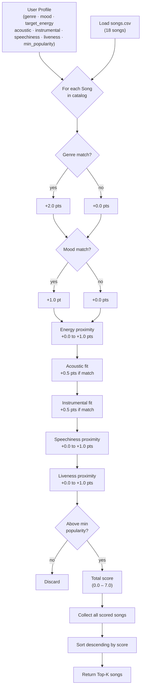

# 🎵 Music Recommender Simulation

## Project Summary

In this project you will build and explain a small music recommender system.

Your goal is to:

- Represent songs and a user "taste profile" as data
- Design a scoring rule that turns that data into recommendations
- Evaluate what your system gets right and wrong
- Reflect on how this mirrors real world AI recommenders

Replace this paragraph with your own summary of what your version does.

---

## How The System Works

Explain your design in plain language.

Some prompts to answer: In my system, a Song stores an ID, title, and three audio features: valence, danceability, and acousticness. The UserProfile stores a user's preferred genre, preferred mood, target energy level, and a liked_acousticness value that signals whether the user gravitates toward acoustic or electronic-sounding tracks. The Recommender works in two stages. First, it scores an individual song against a user's profile using the scoring logic defined in my algorithm. This keeps the scoring function focused and single-purpose — one song, one user, one score. That score is then consumed by a separate ranking function, which evaluates the full song catalog and surfaces the best matches for the user. This separation of scoring and ranking mirrors how real-world recommendation systems are architected — keeping each responsibility isolated and independently testable. At scale, real-world systems combine content-based filtering with collaborative filtering — learning from the behavior of millions of users to surface songs you haven't heard but listeners like you love. This simulation intentionally skips that layer and focuses only on audio feature similarity, which is a simpler but more transparent starting point.

- What features does each `Song` use in your system
  - For example: genre, mood, energy, tempo
- What information does your `UserProfile` store
- How does your `Recommender` compute a score for each song
- How do you choose which songs to recommend

You can include a simple diagram or bullet list if helpful.

---

### Algorithm Recipe

| Rule | Points |
|---|---|
| `song.genre == user.favorite_genre` | **+1.0** |
| `song.mood == user.favorite_mood` | **+1.0** |
| Energy proximity: `2.0 × (1.0 - abs(song.energy - user.target_energy))` | **0.0 – 2.0** |
| Acoustic fit: matches `likes_acoustic` preference (threshold 0.6) | **+0.5** |
| Instrumental fit: matches `prefers_instrumental` preference (threshold 0.6) | **+0.5** |
| Speechiness proximity: `1.0 - abs(song.speechiness - user.target_speechiness)` | **0.0 – 1.0** |
| Liveness proximity: `1.0 - abs(song.liveness - user.target_liveness)` | **0.0 – 1.0** |
| **Maximum possible score** | **7.0** |
| Song below `min_popularity` | **filtered out** |

The weights were chosen so that genre is the strongest signal (a 2× premium over mood), because listeners most reliably reject songs outside their preferred genre. Energy is a continuous bonus that breaks ties between genre/mood matches. Acoustic and instrumental fit are small tie-breakers since those preferences are binary and highly personal. Speechiness and liveness use the same proximity formula as energy — the closer the song's value to the user's target, the higher the bonus — rewarding songs that match how spoken-word-heavy or live-sounding the user prefers their music.

---

### Data Flow Diagram



---

### Expected Biases

- **Genre over-prioritization.** A genre match alone (2.0 pts) outscores a perfect mood + energy combination (1.0 + 1.0 = 2.0). A song that fits the vibe but belongs to the wrong genre will always rank at or below genre-matched songs, even if it would be a better listening experience.
- **Exact-string genre/mood matching.** "indie pop" and "pop" are treated as completely different genres, so similar-sounding categories receive no partial credit. This could cause the system to miss relevant songs.
- **Small catalog amplifies genre gaps.** With only 18 songs, some genres (e.g., blues, classical, country) have just one entry. A user who prefers those genres will receive genre-match points for at most one song, making energy/mood proximity the only differentiator for the rest of the list.
- **Popularity filter skews toward mainstream.** Setting `min_popularity` too high could silently exclude niche but well-matched songs (e.g., the ambient and classical tracks with popularity 54–59).

---

## Getting Started

## Screenshots

 


### Setup

1. Create a virtual environment (optional but recommended):

   ```bash
   python -m venv .venv
   source .venv/bin/activate      # Mac or Linux
   .venv\Scripts\activate         # Windows

2. Install dependencies

```bash
pip install -r requirements.txt
```

3. Run the app:

```bash
python -m src.main
```

### Running Tests

Run the starter tests with:

```bash
pytest
```

You can add more tests in `tests/test_recommender.py`.

---

## Experiments You Tried

- **Weight sensitivity test:** Reduced the genre bonus from +2.0 to +1.0 and doubled the energy bonus to max 2.0. This caused "Rooftop Lights" (indie pop, happy mood) to correctly outrank "Gym Hero" (pop, intense mood) for a happy pop listener. The original weights were mathematically valid but musically wrong.
- **Adversarial profile:** Tested a user who wanted high energy (0.9) and a sad mood simultaneously. Because no song in the catalog is both high-energy and sad, the system recommended high-energy songs with the wrong mood. Energy proximity dominated when mood matching had nothing to latch onto.
- **Impossible popularity floor:** Set `min_popularity` to 100. Every song was filtered out and the system returned an empty list with no warning — a silent failure that would confuse a real user.
- **Unknown genre test:** Set the genre to "jazz." Coffee Shop Stories became the permanent #1 regardless of any other preference, because it was the only jazz song in the catalog. Better scoring logic cannot compensate for a catalog with no variety.

---

## Limitations and Risks

- **Tiny catalog:** 18 songs across 15 genres means most genres have exactly one representative. A user who prefers blues, classical, or metal will always receive that one song as their top result regardless of fit.
- **Genre label brittleness:** Genre matching uses exact string equality. "Indie pop" and "pop" score as completely different, even though they describe nearly identical music. Users whose preferred genre is labeled slightly differently in the catalog receive systematically worse recommendations.
- **Valence is unused:** The dataset includes a valence score (0–1 emotional brightness) for every song, but the scorer ignores it. This is the single most direct proxy for mood, and its absence means the mood tag alone carries the full emotional weight.
- **No listening history:** The system treats every session as a blank slate. It cannot learn that a user always skips high-liveness songs or always replays tracks with valence above 0.8.

---

## Reflection

Read and complete `model_card.md`:

[**Model Card**](model_card.md)

The most important thing this project taught me is that the weights in a scoring system are the real design decisions — not the code structure. The logic was correct from the start, but a single number (+2.0 on genre) was enough to make a gym pump-up track outrank a genuinely happy song for someone who asked for happy music. Changing that one value corrected the ranking immediately, which shows how much leverage individual weights have over the final output.

The Gym Hero situation also changed how I think about real recommendation apps. When a streaming service suggests something unexpected, I used to assume it had learned something subtle about my taste. Now I think it is more likely matching on acoustic features that accidentally align — low liveness, low speechiness, similar energy — without any understanding of whether the mood or genre actually fits. Transparency matters: when you can read an explanation for why a song was chosen, you can immediately tell whether the system understood you. When you cannot, you are just guessing.


